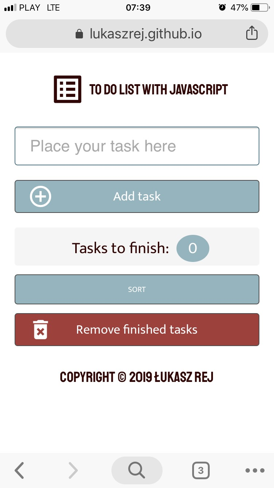
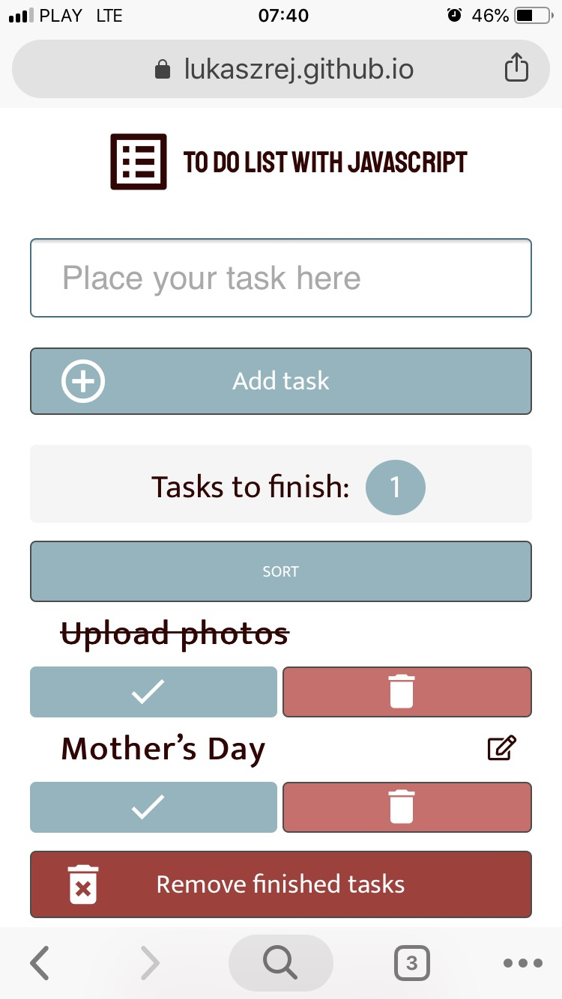

# To-Do-List JavaScript
To-do-list created with JavaScript.

## Github.pages
Visit the repo on github.pages: https://lukaszrej.github.io/To-Do-List_JavaScript/

## Functionalities
* Adding tasks to the list
* Counter of tasks to be finished
* Editing task
* Marking task as completed
* Sorting tasks by task name
* Finding task by task name
* Deleting tasks / deleting all completed tasks

### Page preview

